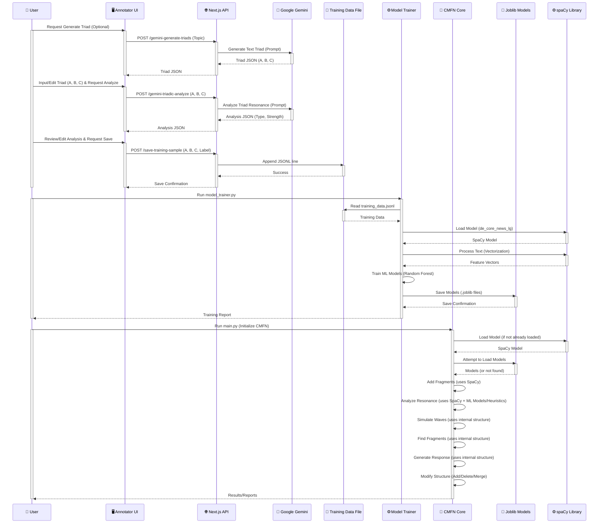

```mermaid
%% title: Das lebendige Netz des Denkens - System Architecture Sequence Diagram
sequenceDiagram
    participant User as 👤 User
    participant AnnotatorUI as 🖥️ Annotator UI
    participant NextjsAPI as 🌐 Next.js API
    participant Gemini as 🔗 Google Gemini
    participant TrainingData as 📄 Training Data File
    participant ModelTrainer as ⚙️ Model Trainer
    participant CMFNCore as 🧠 CMFN Core
    participant JoblibModels as 💾 Joblib Models
    participant SpaCy as ⚙️ spaCy Library

    %% === Annotation Workflow ===
    User->>AnnotatorUI: Request Generate Triad (Optional)
    activate User
    activate AnnotatorUI
    AnnotatorUI->>NextjsAPI: POST /gemini-generate-triads (Topic)
    activate NextjsAPI
    NextjsAPI->>Gemini: Generate Text Triad (Prompt)
    activate Gemini
    Gemini-->>NextjsAPI: Triad JSON (A, B, C)
    deactivate Gemini
    NextjsAPI-->>AnnotatorUI: Triad JSON
    deactivate NextjsAPI
    deactivate AnnotatorUI

    User->>AnnotatorUI: Input/Edit Triad (A, B, C) & Request Analyze
    activate AnnotatorUI
    AnnotatorUI->>NextjsAPI: POST /gemini-triadic-analyze (A, B, C)
    activate NextjsAPI
    NextjsAPI->>Gemini: Analyze Triad Resonance (Prompt)
    activate Gemini
    Gemini-->>NextjsAPI: Analysis JSON (Type, Strength)
    deactivate Gemini
    NextjsAPI-->>AnnotatorUI: Analysis JSON
    deactivate NextjsAPI
    deactivate AnnotatorUI

    User->>AnnotatorUI: Review/Edit Analysis & Request Save
    activate AnnotatorUI
    AnnotatorUI->>NextjsAPI: POST /save-training-sample (A, B, C, Label)
    activate NextjsAPI
    NextjsAPI->>TrainingData: Append JSONL line
    activate TrainingData
    TrainingData-->>NextjsAPI: Success
    deactivate TrainingData
    NextjsAPI-->>AnnotatorUI: Save Confirmation
    deactivate NextjsAPI
    deactivate AnnotatorUI
    deactivate User

    %% === Training Workflow ===
    User->>ModelTrainer: Run model_trainer.py
    activate User
    activate ModelTrainer
    ModelTrainer->>TrainingData: Read training_data.jsonl
    activate TrainingData
    TrainingData-->>ModelTrainer: Training Data
    deactivate TrainingData
    ModelTrainer->>SpaCy: Load Model (de_core_news_lg)
    activate SpaCy
    SpaCy-->>ModelTrainer: SpaCy Model
    deactivate SpaCy
    ModelTrainer->>SpaCy: Process Text (Vectorization)
    activate SpaCy
    SpaCy-->>ModelTrainer: Feature Vectors
    deactivate SpaCy
    ModelTrainer->>ModelTrainer: Train ML Models (Random Forest)
    ModelTrainer->>JoblibModels: Save Models (.joblib files)
    activate JoblibModels
    JoblibModels-->>ModelTrainer: Save Confirmation
    deactivate JoblibModels
    ModelTrainer-->>User: Training Report
    deactivate ModelTrainer
    deactivate User

    %% === Application Workflow ===
    User->>CMFNCore: Run main.py (Initialize CMFN)
    activate User
    activate CMFNCore
    CMFNCore->>SpaCy: Load Model (if not already loaded)
    activate SpaCy
    SpaCy-->>CMFNCore: SpaCy Model
    deactivate SpaCy
    CMFNCore->>JoblibModels: Attempt to Load Models
    activate JoblibModels
    JoblibModels-->>CMFNCore: Models (or not found)
    deactivate JoblibModels
    CMFNCore->>CMFNCore: Add Fragments (uses SpaCy)
    CMFNCore->>CMFNCore: Analyze Resonance (uses SpaCy + ML Models/Heuristics)
    CMFNCore->>CMFNCore: Simulate Waves (uses internal structure)
    CMFNCore->>CMFNCore: Find Fragments (uses internal structure)
    CMFNCore->>CMFNCore: Generate Response (uses internal structure)
    CMFNCore->>CMFNCore: Modify Structure (Add/Delete/Merge)
    CMFNCore-->>User: Results/Reports
    deactivate CMFNCore
    deactivate User

```
